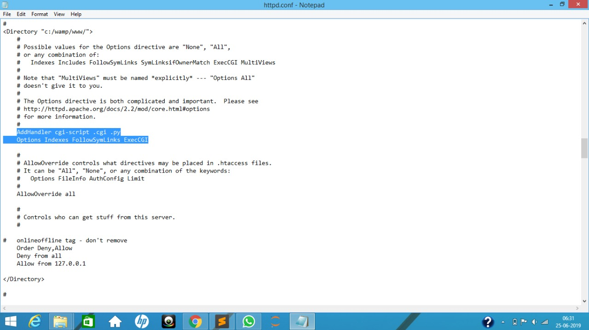

Steps to run the Web Application, Friend_Affinity_Finder:
  1. Download and Install <b>WAMP Server</b> (between Version 2 to 3)
  2. Click on the WAMP Symbol in system tray and open the <b>httpd.conf</b> file inside Apache and write the following code under
     <Directory “c:/wamp/www/”>  
     <b>AddHandler cgi-script .cgi .py 
     Options Indexes FollowSymLinks ExecCGI</b>  
     
     This enables the Python CGI for Back-End Development
  3. Download the application file, <b>friend_affinity_finder.zip</b> and extract its contents in the <b>www</b> folder inside <b>wamp</b>
     which will be installed in the path mentioned during installation
  4. Go to a web browser and type <b>localhost/friend_affinity_finder</b> and press Enter
   
  
